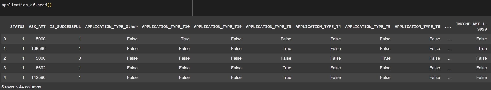
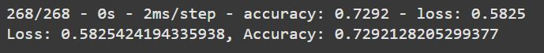
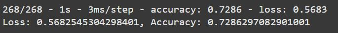
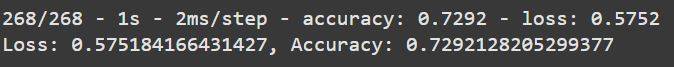
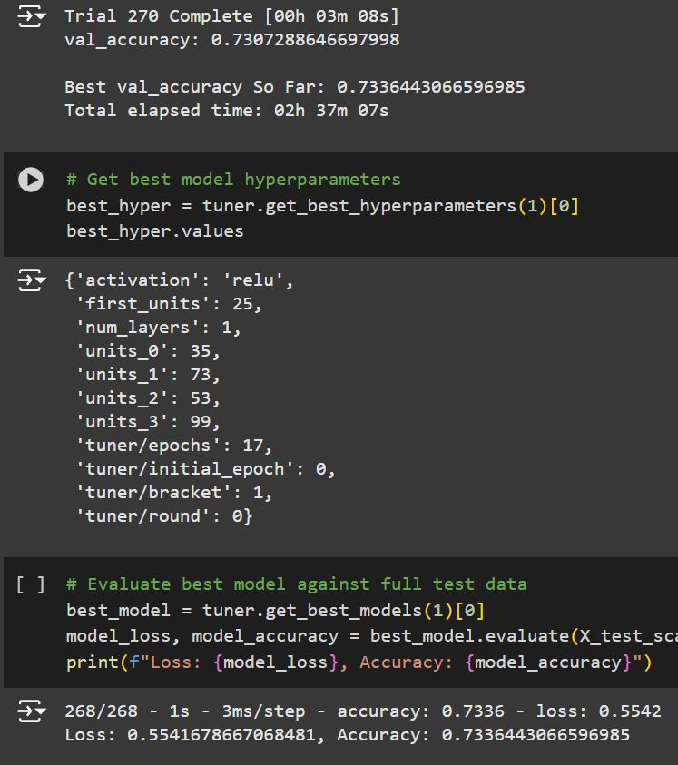
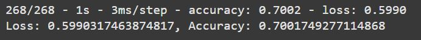

# Binary Classifier Machine Learning Model

## 1. Overview
### In this project, I processed and analyzed a dataset for the nonprofit Alphabet Soup that helps predict successful applicants. Using a dataset with records of over 34,000 organizations that did receive funding in the past, I created a binary classifier that aims to predict if a new applicant would be succesful in their ventures.

## 2. Results
**Data Preprocessing:**
- The target variable for this model was the "IS_SUCCESSFUL" column because an organization's change of success is what I aimed to predict in the model.
- The feature variables were the following columns: Application Type, Affiliation, Classification, Use Case, Organization, Status, Income Amount, Special Considerations, and Asking Amount. All of these variables combined are what contribute to a venture being succesful or not.
- I removed two identification columns, EIN and NAME, because they were neither targets or features.

Preprocessed Dataframe:

**Compiling, Training, And Evaluating the Model:**
- In my first model, I began with 128 neurons in the input layer, 128 in the first hidden layer, 64 in the second hidden layer, and 1 in the output layer. I used the ReLU activation function for each layer other than the output, which I used Sigmoid for. I began with ReLU and Sigmoid for the activation functions because they are ideal for modeling data for classification. The first model's results were: 0.729 Accuracy and 0.583 Loss, below the 75% accuracy target:

- In order to improve the model's performance, I made various adjustments. In the second test, I increased the units in the layers, added a third hidden layer, and reduced the number of epochs. These changes didn't make any significant difference: the loss went from 0.583 to 0.568 and the accuracy barely went up:

- I tried a third model with the same neurons and epochs as the original because that didn't affect anything in the second test, but with a different activation function for all layers besides the output layer. The loss went slightly down to 0.575, and the accuracy was still at 0.729:

- For the fourth model, I decided to use an optimization function to find the best hyperparameters. I tweaked the limits of this a few times because it was going to take too long to run. The function looped through the ReLU, Tanh, and Sigmoid activation functions, up to 128 neurons in the first layer, 164 in the hidden layers with up to for hidden layers, with 50 max epochs. The best model hyperparameters resulted in loss of 0.568 and accuracy of 0.729, which was the same as the other models.

- Finally, I decided to run the model on a revised dataset, with the Application Type and Classification columns removed, as I thought these columns may not be as relevant to whether or not a lender is succesful. I ran this model using the hyperparameters that the optimization function gave me, and the results were actually the worst of all the models: 0.601 loss and 0.702 accuracy:

## 3. Summary
### Overall, the five different models I compiled, trained, and evaluated all performed within a couple points of each other, and all were below 75%, a non-optimal result. While there might be a couple more tweaks that could be made to find the optimal model, it seems as if this particular dataset and goal of predicting if an Alphabet Soup applicant will be succesful is too difficult to predict with a high degree of accuracy.